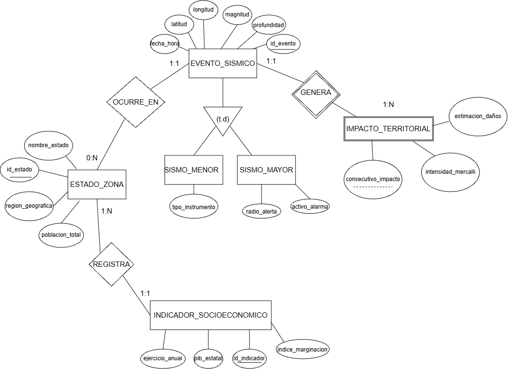

# Ejercicio 5. Modelo EER del Proyecto Asignado

- **Proyecto:** Seismic-Data-Visualization-System
- **Repositorio de referencia:** https://github.com/FERVERDZ18/Seismic-Data-Visualization-System
- **Commit ID:** 8569667
- **Materia:** Bases de Datos — Práctica 2

---

## 1. Justificación y Análisis del Dominio Real vs. Esquema Dimensional

El esquema de base de datos provisto en el repositorio asignado implementa un diseño analítico de tipo Almacén de Datos (Data Warehouse) con arquitectura en estrella (`dim_sismos`, `dim_zonas`, `dim_tiempo`, `dim_economia` y `fact_impacto_sismos_imputed`). Dicho esquema desnormaliza y reestructura la información con el propósito de optimizar consultas de agregación analítica (OLAP).

Para la reconstrucción del **Modelo Conceptual Extendido (EER)** solicitado, se abstrae la mecánica dimensional y se representan los entes y fenómenos del mundo real que originan dichos datos:
- Los fenómenos geológicos individuales (**Eventos Sísmicos**).
- Las divisiones territoriales donde ocurren o tienen repercusión (**Estados / Regiones Geográficas**).
- El contexto socioeconómico continuo medido a través de censos (**Indicadores Económicos**).
- La afectación estructural o física producida (**Impacto Territorial**).

---

## 2. Descripción de Entidades y Relaciones

### Entidades del Dominio
1. **ESTADO_ZONA:** Representa a la entidad federativa o región territorial de la República Mexicana.
   - *Atributos:* `id_estado` (PK), `nombre_estado`, `region_geografica`, `poblacion_total`.
2. **EVENTO_SISMICO:** Representa la perturbación geológica ocurrida en un instante determinado.
   - *Atributos:* `id_evento` (PK), `fecha_hora`, `latitud`, `longitud`, `magnitud`, `profundidad`.
3. **INDICADOR_SOCIOECONOMICO:** Representa los estudios periódicos demográficos y financieros de cada región.
   - *Atributos:* `id_indicador` (PK), `ejercicio_anual`, `pib_estatal`, `indice_marginacion`.
4. **IMPACTO_TERRITORIAL (Entidad Débil):** Registro de evaluación del impacto, daños y percepción sísmica en una región particular a raíz de un sismo específico.
   - *Atributos:* `consecutivo_impacto` (Discriminador/PK parcial), `grado_intensidad_mercalli`, `estimacion_danos_financieros`, `personas_afectadas`.

### Relaciones y Cardinalidades
- **REGISTRA (ESTADO_ZONA - INDICADOR_SOCIOECONOMICO):**
  - Un Estado registra de uno a muchos `(1, N)` indicadores a lo largo de los años.
  - Un indicador socioeconómico pertenece estrictamente a uno y solo un `(1, 1)` Estado.
- **OCURRE_EN (EVENTO_SISMICO - ESTADO_ZONA):**
  - Un sismo tiene su epicentro ubicado en un único `(1, 1)` Estado o zona geográfica asociada.
  - Un Estado puede haber sido la sede de ocurrencia de cero a muchos `(0, N)` eventos sísmicos.
- **GENERA (EVENTO_SISMICO - IMPACTO_TERRITORIAL):**
  - Un evento sísmico mayor genera una o muchas `(1, N)` evaluaciones de impacto en las zonas circundantes.
  - Un registro de impacto territorial depende existencialmente de un único `(1, 1)` evento sísmico.

---

## 3. Jerarquías y Entidades Débiles

### Jerarquía de Especialización (Generalización / Especialización)
- **Superentidad:** `EVENTO_SISMICO`
- **Criterio de Especialización:** Magnitud del sismo y protocolo de alertamiento.
- **Subentidades:**
  - `SISMO_MENOR` (Magnitud $< 4.5$): Movimientos de baja energía, perceptibles únicamente de forma instrumental; no ameritan activación de alerta sísmica institucional ni desencadenan reportes de impacto estructural.
  - `SISMO_MAYOR` (Magnitud $\ge 4.5$): Movimientos telúricos moderados o fuertes que desencadenan alertamiento y cálculo de radio de afectación económica/física.
- **Tipo de Jerarquía:** **Total y Disjunta** $(t, d)$, ya que todo sismo registrado tiene una magnitud asignada y no puede pertenecer a ambas clasificaciones simultáneamente.

### Entidad Débil
- **Entidad Débil:** `IMPACTO_TERRITORIAL`
- **Tipo:** Dependencia por existencia y por identificación.
- **Justificación:** No tiene existencia física independiente sin la ocurrencia de un `EVENTO_SISMICO` y sin un `ESTADO_ZONA` afectado. Su llave primaria es compuesta por la llave del evento sísmico junto a su consecutivo interno.

---

## 4. Tabla de Correspondencia: Modelo Conceptual vs. Esquema Publicado

| Entidad / Concepto Real | Tabla(s) en el Almacén de Datos | Información que se pierde al pasar al almacén | Información que se agrega o desnormaliza |
| :--- | :--- | :--- | :--- |
| **EVENTO_SISMICO** | `dim_sismos` | Se pierde el timestamp continuo exacto (horas, minutos, segundos) y datos de la red sismológica receptora. | Se generan categorías discretas de magnitud y etiquetas descriptivas de profundidad para filtrado analítico. |
| **ESTADO_ZONA** | `dim_zonas` | Se omiten coordenadas perimetrales de límites geopolíticos, división a nivel municipal y topografía. | Se crea una surrogate key entera (`id_zona`) y se estandariza el nombre regional para agregaciones OLAP. |
| **Tiempo de Ocurrencia** | `dim_tiempo` | Deja de modelarse como un atributo escalar (`TIMESTAMP`) del evento. | Se descompone en atributos derivados (`año`, `mes`, `día`, `trimestre`, `día_semana`) para optimizar cláusulas `GROUP BY`. |
| **INDICADOR_SOCIOECONOMICO** | `dim_economia` | Se pierde el historial de auditoría de capturas censales del INEGI. | Se incorporan valores precalculados o imputados para normalizar series de tiempo incompletas. |
| **IMPACTO_TERRITORIAL** | `fact_impacto_sismos_imputed` | Se pierde el seguimiento cualitativo y bitácoras de cuerpos de protección civil. | Se construyen llaves foráneas compuestas y métricas numéricas consolidadas (hechos analíticos). |

## 5. Diagrama Conceptual EER

